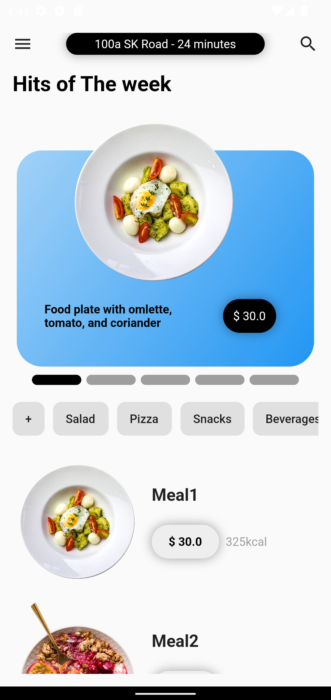
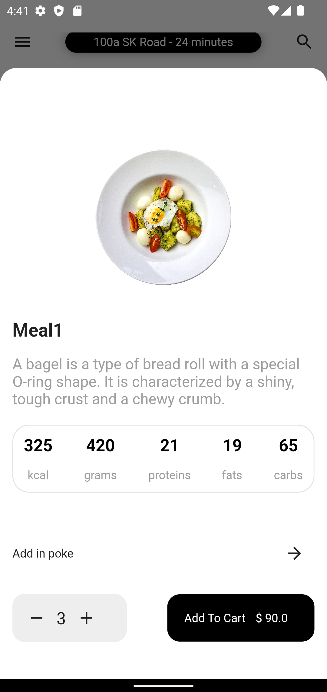
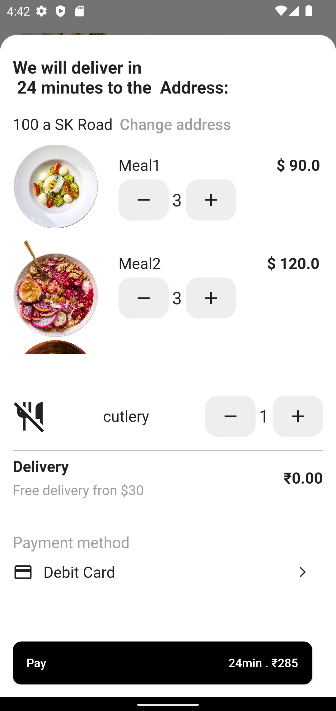

# food_delivery_app

This is a simple Food Delivery App
In this app a have create a complete ui and add some logic function like add meal to cart, deleate from the cart. To remove the cart item from the  cart you have to done count to zero(0).

